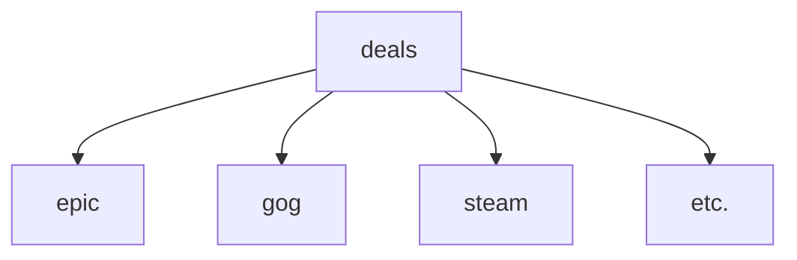

<div align="center">
  <a href="https://discord.com/oauth2/authorize?client_id=827564914733350942">
    </a>
  <a href="https://discord.com/api/oauth2/authorize?client_id=827564914733350942&permissions=534723885120&scope=bot">
    </a>
  <a href="https://x.com/_MercuryBot_">
    </a>
  <a href="https://bsky.app/profile/mercurybot.bsky.social">
    </a>
</div>

# MercuryBot

MercuryBot is a Discord, Bluesky and X, formerly known as twitter, bot that monitors various platforms to find and notify users about new free game promotions. Stay updated on the latest giveaways from Epic Games, Steam, GOG, PS Plus, and Amazon Prime Gaming, and never miss out on the opportunity to grab titles for free. Discover more on our [website](https://5okin.github.io/mercurybot-web/).

<br>

<div align="center">
    <a href="https://x.com/_MercuryBot_"></a>
    <a href="https://discord.com/oauth2/authorize?client_id=827564914733350942"></a>
    <a href="https://bsky.app/profile/mercurybot.bsky.social"></a>
</div>

<br>

<p align='center'>
    <a href= "https://discord.com/oauth2/authorize?client_id=827564914733350942"> 
    </a>
<p><br>

Mercury bot sends you notifications like the ones bellow every time there's a new free game available, so you never miss out again. For epic notifications on Discord, it also sends you next weeks free game (if available) all in one notification!

Discord             |  X            |  Bluesky
:-------------------------:|:-------------------------:|:-------------------------:
 |  | 


## Features

- **Multi-Platform Support:** MercuryBot monitors free game promotions on Epic Games, Steam, GOG, PS Plus, and Amazon Prime Gaming.

- **Online 24/7:** Bot doesn't go offline ensuring you dont miss out on any deal!

- **Automated Reminders:** Receive timely reminders in your Discord server, X or Bluesky feed when new free games become available.

- **Reaction Roles:** Users can self-assign platform-specific roles using reactions for granular notification control.

- **Customizable Settings:** Configure MercuryBot to tailor notifications to your preferences on discord.

- **Ephemeral Messages:** Commands you send to the bot won't spam and clutter your channels, they stay invisible to everyone but you.

- **Privacy focused:** Using slash commands the bot never has access to your messages.


## Discord

### Slash Commands
- `/settings`: Setup and review your notification preferences.
- `/roles`: Set up reaction roles for platform-specific notifications. Users can react to get roles for their favorite platforms.
- `/testnotify`: Send a test notification to verify your setup (Admin only).
- `/deals`: Display a list of available stores and get the current available games (Ephemeral Message).
- `/feedback`: Send feedback or bug reports.

### Web Interface

MercuryBot includes a web-based admin panel for easy configuration:

- **Dashboard:** View statistics, configure emojis, monitor active stores
- **Test Notifications:** Send test notifications to verify setup
- **Template Documentation:** Learn how to customize notification messages

Access at: `http://localhost:5000` (or your server IP)

For detailed setup instructions, see [web/README.md](web/README.md) 

### How to use

1. Invite MercuryBot to your Discord server. [](https://discord.com/oauth2/authorize?client_id=827564914733350942=bot)

2. Run the `/settings` slash command and configure the bot:

    - `Test notifications`: Test your settings.
    - `Set channel`: The channel to receive the notifications.
    - `Set role`: Specify the role to be pinged for notifications (optional).
    - `Set stores`: Set the store you wish to receive notifications for.

<p align='center'>
    <image src="https://github.com/user-attachments/assets/7ac02668-ed91-41ae-b12a-576788b64b99">
<p>

3. Enjoy automatic alerts for new free games on various platforms.


### Command breakdown

- The `Test notifications` button sends a notification to the set channel, pinging the set role to ensure everything works correctly.
<p align='center'>
 <image src="https://github.com/user-attachments/assets/0806c7b4-5ddd-402a-90e1-c4ba4e6e9584">
<p>

- The `Set channel` button allowes you to set the channel the channel you want the bot to send the notifications to. If its a locked channel make sure to give the bot permissions. A channel must be set.
<p align='center'>
 <image src="https://github.com/user-attachments/assets/000b9130-5e67-4864-a070-45f2c42184b6">
<p>

- When setting a channel, you will be notified if you select a channel that the bot lacks permissions for.
<p align='center'>
 <image src="https://github.com/user-attachments/assets/29d6541a-dfb3-4456-bcf2-7db7d02b0f74">
<p>

- The `Set role` button allowes you set the role that will be pinged when a notification is send, you can choose not to ping any roles.
<p align='center'>
 <image src="https://github.com/user-attachments/assets/36d13c17-d472-497c-bb91-f2211891cd14">
<p>

- The `Set stores` button allows you change the stores for which you receive notifications.
<p align='center'>
 <image src="https://github.com/user-attachments/assets/f3c16310-3439-4a11-afaf-5413b0dbfcf9">
<p>

## Project Structure
```
📁 MercuryBot
│── 📂 clients
│ ├── 📜 discord.py     # Discord bot implementation
│ ├── 📜 bluesky.py     # Bluesky integration
│ ├── 📜 twitter.py     # X (Twitter) integration
│── 📂 stores
│ ├── 📜 epic_games.py  # Epic Games store handler
│ ├── 📜 steam.py       # Steam store handler
│ ├── 📜 gog.py         # GOG store handler
│ ├── 📜 ps_plus.py     # PlayStation Plus store handler
│── 📂 utils
│ ├── 📜 logger.py      # Logging utility
│ ├── 📜 helpers.py     # Helper functions
│── 📜 main.py          # Main entry point of the bot
│── 📜 .env.example     # Environment configuration template
│── 📜 requirements.txt # Python dependencies
│── 📜 LICENSE          # License information
│── 📜 Procfile         # Deployment process file
│── 📜 README.md        # Project documentation
```

## Running it on your own

- Download or clone the repository.
- Make sure you have python 3.10 or higher installed. `python -V`
- Install the required dependencies by running. `pip install -r requirements.txt`
- Obtain a working [discord bot TOKEN](#get-a-discord-token) and [mongoDB server](#mongodb-connection-string) running.
- Optionally, set up a [twitter key](#get-twitter-keys) and [BlueSky account](#get-a-bluesky-account) but these aren't required.  
- Add your credentials to the [.env](#env-file) file.
- Run it using: `python3 main.py`

### Get a discord TOKEN
Log in to https://discord.com/developers/applications/ and click on the New Application button. Go to the bot tab and click the Add Bot button to get a TOKEN.

### Get twitter Keys
You can follow twitters documentation https://developer.x.com/en/docs/twitter-api/getting-started/getting-access-to-the-twitter-api to get started.

### Get a Bluesky account
All you need to do is create a normal Bluesky account https://bsky.app/ 

### MongoDB connection string
The database used is MongoDB, you can use mongodb atlas which offers a shared $0/month plan, if you don't want to host your own database. Navigate to ***DEPLOYMENT*** > ***Database*** > ***Connect*** > ***Drivers*** to obtain a connection string (eg., `mongodb+srv://...`)


### `.env` file

Copy or rename the [`.env.example`](.env.example) file to `.env` and edit it with your data.

Here is an explanation of what everything is:
| Variable               | What it is                                                                                        |
| ---------------------- | ----------------------------------------------                                                    |
| DEBUG                  | Can be `true` or `false`. Controls log output and bot configuration (test vs. live).              |
| DB_CONNECTION_STRING   | Your mongoDB connection string                                                                    |
| DISCORD_TOKEN_LIVE     | Live discord TOKEN, used when DEBUG=False                                                         |
| DISCORD_TOKEN_TEST     | Test/Dev discord TOKEN, used when DEBUG=True                                                      |
| X_ACCESS_TOKEN         | Twitter/X access token                                                                            |
| X_ACCESS_TOKEN_SECRET  | Twitter/X access token secret                                                                     | 
| X_API_KEY              | Twitter/X api key                                                                                 |
| X_API_SECRET           | Twitter/X api secret                                                                              |
| DISCORD_DEV_GUILD      | Test Guild Id (not necessary)                                                                     |
| DISCORD_ADMIN_ACC      | Your account Id (not necessary)                                                                   |
| BSKY_USER              | Your account username                                                                             |
| BSKY_PASSWORD          | Your account password                                                                             |


- When `DEBUG` variable is set to True, the log output is changed, the bot uses DISCORD_TOKEN_TEST instead of DISCORD_TOKEN_LIVE and the twitter and bluesky clients dont run at all.

- When in `DEBUG` mode the bot can use `DISCORD_DEV_GUILD` to sync commands to that specific guild to cut down on wait times.

- If you wish to receive discord direct messages from the bot for things like bot restart, feedback send, etc you can set `DISCORD_ADMIN_ACC`.

### MongoDB
There are three databases created `deals`, `feedback` and `servers` (with _dev variants for debug mode).

| Database    | Contents                                                                                                              |
| ------      | ------                                                                                                                |
| `deals`     | Contains a number of collections, one for every store (eg., steam, epic)                                              |
| `feedback`  | Stores feedback and bug reports submitted via Discord.                                                                |
| `servers`   | Contains a collection with the servers and the preferences and configurations for every discord server the bot is in  |

#### Deals database:


Each collection contains all the information required for its respective store.

|               |                                                                                           |
| ------        | ------                                                                                    |
| `title`       | Game name.                                                                                |
| `activeDeals` | boolean `0` or `1`. If the deal is active right now or its a feature offer.               |
| `url`         | The url of the game.                                                                      | 
| `startDate`   | When the deal starts.                                                                     |
| `endDate`     | When the deal is set to end.                                                              |
| `image`       | The image (usually gif) that is created containing all the game art.                      |
| `wideImage`   | Social media-optimized image.                                                             |

#### servers database
This datebase only has a collection for discord. For the time being its the only implementation that requires it.

|                         |                                                                                           |
| ------                  | ------                                                                                    |
| `server`                | Guild id.                                                                                 |
| `channel`               | Channel id.                                                                               |
| `population`            | The number of actual people in the server.                                                |
| `server_name`           | The name of the server.                                                                   |
| `role`                  | The role id that is to be pinged in the notifications send.                               |
| `notification_settings` | A integer number that represents what notifications the server wants to receive.          |
| `role_message_id`       | (Optional) The message ID for reaction-role assignment.                                   |
| `role_channel_id`       | (Optional) The channel ID where the reaction-role message is located.                     |
| `role_mappings`         | (Optional) Dictionary mapping emoji IDs to role IDs for reaction-role functionality.     |


#### notification_settings
To optimize storage and simplify notification settings, MercuryBot uses a compact integer-based encoding system for `notification_settings`:

- Each store is assigned a unique integer ID:
  - Epic Games: `1`
  - GOG: `2`
  - Steam: `3`
  - PS Plus: `4`
  - Amazon Prime Gaming: `5`
  - (Additional stores can be added as needed.)

- These IDs are combined into a single integer to represent notification preferences. For example:
  - `1235`: Notifications for Epic Games, GOG, Steam, and Amazon Prime Gaming.
  - `23`: Notifications for GOG and Steam only.
  - `5`: Notifications for Amazon Prime Gaming only.

This method is both space-efficient and scalable.

**Decoding Logic**:
- To determine if notifications are enabled for a specific store, parse the integer into its individual digits.
- For example, if `notification_settings = 1235`, notifications are enabled for stores `1`, `2`, `3`, and `5`.


## Contributions

Contributions are welcome! If you have any ideas for improvements or new features, feel free to submit a pull request.
