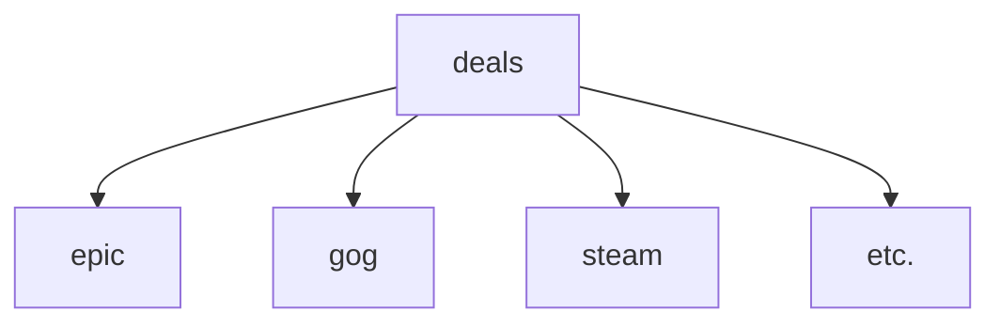

<div align="center">
  <a href="https://discord.com/oauth2/authorize?client_id=827564914733350942">
    </a>
  <a href="https://discord.com/oauth2/authorize?client_id=827564914733350942">
    </a>
  <a href="https://bsky.app/profile/mercurybot.bsky.social">
    </a>
</div>

# MercuryBot

MercuryBot is a Discord and Bluesky bot that monitors multiple platforms for free game promotions and automatically notifies users when new deals become available.

It currently monitors:
- Epic Games
- Epic Games Mobile
- Steam
- GOG
- PlayStation Plus
- Luna (Prime Gaming)

Never miss an opportunity to claim free games. Learn more on our [website](https://5okin.github.io/mercurybot-web/).

> **Note:** MercuryBot previously supported automated posting to X (formerly Twitter). Due to changes in X API pricing, maintaining automated posting is no longer sustainable, and X posting has been discontinued.

<br>

<div align="center">
    <a href="https://x.com/_MercuryBot_"></a>
    <a href="https://discord.com/oauth2/authorize?client_id=827564914733350942"></a>
    <a href="https://bsky.app/profile/mercurybot.bsky.social"></a>
</div>

<br>

<p align='center'>
    <a href="https://discord.com/oauth2/authorize?client_id=827564914733350942">
    </a>
<p><br>

MercuryBot sends notifications like the examples below whenever a new free game becomes available. For Epic Games notifications on Discord, the following week's free game is also included when available, in the same notification.

Discord             |  X            |  Bluesky
:-------------------------: | :-----------------------------------------------------------------------------------------------------: | :-----------------------------------------------------------------------------------------: |
|  |  |  |

## Features

- **Multi-Platform Support:** MercuryBot monitors free game promotions across multiple stores and services.
- **Online 24/7:** MercuryBot runs continuously to ensure you never miss a deal.
- **Automated Notifications:** Receive notifications whenever new free games become available.
- **Customizable Settings:** Configure MercuryBot to tailor notifications to your preferences on Discord.
- **Ephemeral Messages:** Slash commands return private responses that do not clutter your channels.
- **Privacy-Focused:** MercuryBot uses slash commands and does not require access to messages in your server.

## Discord

### Slash Commands
- `/settings`: Configure and review your notification preferences.
- `/deals`: View the currently available free games. *(Ephemeral message.)*
- `/feedback`: Submit feedback or report a bug.

### How to Use

1. Invite MercuryBot to your Discord server. [](https://discord.com/oauth2/authorize?client_id=827564914733350942)

2. Run `/settings`.

3. Configure your notification preferences:

   - **Test notifications:** Send a test notification to verify your configuration.
   - **Post Selected Store Deals:** Post the currently available free games from your selected stores.
   - **Set channel:** Select the channel where notifications should be sent.
   - **Set role:** Select an optional role to mention when notifications are sent.
   - **Set stores:** Choose which stores you want to receive notifications from.
   - **Skip low-quality games:** Optionally skip notifications for games considered low-quality.

4. Save your settings and let MercuryBot handle the rest.

<p align='center'>
    <image src="https://github.com/user-attachments/assets/367eb47c-469d-41ec-af77-e18c029ec5e5">
<p>

### Command Breakdown

- **Test notifications**
  
  The `Test notifications` button sends a test notification to your configured channel and mentions the configured role, allowing you to verify that your settings are working correctly.

  <p align='center'>
   <image src="https://github.com/user-attachments/assets/0806c7b4-5ddd-402a-90e1-c4ba4e6e9584">
  <p>

- **Post Selected Store Deals**

  The `Post Selected Store Deals` button posts the currently available free games from all selected stores to the configured channel.
  <p align='center'>
   <image src="https://github.com/user-attachments/assets/76f77a13-d1d6-46a5-8f6f-198220c294a0">
  <p>

- **Set channel**

  The `Set channel` button allows you to choose which channel receives notifications.
  <p align='center'>
   <image src="https://github.com/user-attachments/assets/000b9130-5e67-4864-a070-45f2c42184b6">
  <p>

  MercuryBot must have permission to send messages in the selected channel. If it does not have the required permissions, MercuryBot will notify you.
  <p align='center'>
   <image src="https://github.com/user-attachments/assets/29d6541a-dfb3-4456-bcf2-7db7d02b0f74">
  <p>

- **Set role**

  The `Set role` button allows you to select a role to mention when a notification is sent.
  <p align='center'>
   <image src="https://github.com/user-attachments/assets/36d13c17-d472-497c-bb91-f2211891cd14">
  <p>

- **Set stores**

  The `Set stores` button allows you to select which platforms you want to receive notifications from.
  <p align='center'>
   <image src="https://github.com/user-attachments/assets/c0c03f56-837b-41d5-ac51-648078bfd49d">
  <p>

- **Skip low-quality games**

  The `Skip low-quality games` toggle allows you to choose whether to skip notifications for "low-quality" titles. Currently, this applies to Steam games marked with the **Profile Features Limited** tag.
  <p align='center'>
   <image src="https://github.com/user-attachments/assets/8b4a117e-3c64-40b5-9cc9-06eecca6d5f2">
  <p>

## Project Structure
```text
📁 MercuryBot/
│── 📂 clients/
│ ├── 📜 discord.py     # Discord bot implementation
│ ├── 📜 bluesky.py     # Bluesky integration
│ └── 📜 twitter.py     # X integration
│
│── 📂 stores/
│ ├── 📜 epic_mobile.py # Epic Games Mobile handler
│ ├── 📜 epic.py        # Epic Games handler
│ ├── 📜 gog.py         # GOG handler
│ ├── 📜 luna.py        # Luna handler
│ ├── 📜 ps_plus.py     # PlayStation Plus handler
│ └── 📜 steam.py       # Steam handler
│
│── 📂 utils/
│ ├── 📜 logger.py      # Logging utility
│ └── 📜 helpers.py     # Helper functions
│
│── 📜 main.py          # Main entry point of the bot
│── 📜 .env.example     # Environment configuration template
│── 📜 requirements.txt # Python dependencies
│── 📜 LICENSE          # Project license
│── 📜 Dockerfile       # Docker configuration
│── 📜 fly.toml         # Deployment configuration
└── 📜 README.md        # Project documentation
```

## Running MercuryBot Yourself

Before running MercuryBot, you will need:

- Python 3.12 or newer (`python -V`)
- A [Discord bot token](#get-a-discord-token)
- A [MongoDB database](#mongodb)
- A [Bluesky account](#get-a-bluesky-account) *(optional)*

### Installation

1. Clone the repository:

   ```bash
   git clone https://github.com/5okin/MercuryBot.git
   cd MercuryBot
   ```

2. Install the required dependencies:

   ```bash
   pip install -r requirements.txt
   ```

3. Install Playwright and Chromium:

   ```bash
   python -m playwright install-deps
   python -m playwright install chromium
   ```

4. Create your environment file:

   ```bash
   cp .env.example .env
   ```

5. Edit [`.env`](#env-file) and add your configuration.


### Running Locally
Start MercuryBot with:

```bash
python3 main.py
```

### Docker

Build the Docker image:

```bash
docker build -t mercurybot .
```

Run the bot in a container using your `.env` file:

```bash
docker run -d --env-file .env mercurybot
```

### `.env` File

MercuryBot uses environment variables for configuration. Copy or rename the [`.env.example`](.env.example) file to `.env` and configure the required values.

The following table describes each variable:

| Variable                | Description                                                                                    |
| ----------------------- | ---------------------------------------------------------------------------------------------- |
| `DEBUG`                 | Can be `true` or `false`. Controls logging and bot configuration (development vs. production). |
| `DB_CONNECTION_STRING`  | Your MongoDB connection string.                                                                |
| `DISCORD_TOKEN_LIVE`    | Production Discord token, used when `DEBUG=false`.                                             |
| `DISCORD_TOKEN_TEST`    | Development Discord token, used when `DEBUG=true`.                                             |
| `X_ACCESS_TOKEN`        | X API access token.                                                                            |
| `X_ACCESS_TOKEN_SECRET` | X API access token secret.                                                                     |
| `X_API_KEY`             | X API key.                                                                                     |
| `X_API_SECRET`          | X API secret.                                                                                  |
| `DISCORD_DEV_GUILD`     | Optional Discord development guild ID.                                                         |
| `DISCORD_ADMIN_ACC`     | Discord account ID used for administrative notifications.                                      |
| `BSKY_USER`             | Bluesky account username.                                                                      |
| `BSKY_PASSWORD`         | Bluesky account password.                                                                      |

### Debug Mode

When `DEBUG=true`:

* Development logging is enabled.
* `DISCORD_TOKEN_TEST` is used instead of `DISCORD_TOKEN_LIVE`.
* Bluesky and X clients are disabled.
* `DISCORD_DEV_GUILD` can be used to synchronize slash commands to a specific development server, reducing command registration delays.

## Setting Up External Services

### Get a Discord Token

Create a Discord application through the [Discord Developer Portal](https://discord.com/developers/applications/). Create a bot for your application and copy its token into the appropriate environment variable.

### Get a Bluesky Account

Create a Bluesky account at [bsky.app](https://bsky.app/) and use its credentials for the `BSKY_USER` and `BSKY_PASSWORD` environment variables.

### Get X Keys

Follow [X's documentation](https://developer.x.com/en/docs/twitter-api/getting-started/getting-access-to-the-twitter-api) to get started with the X API.

### MongoDB

MercuryBot uses MongoDB as its database. You can host MongoDB yourself or use a managed service such as MongoDB Atlas, which offers a shared $0/month plan.

For MongoDB Atlas, navigate to **Deployment → Database → Connect → Drivers** to obtain a connection string (for example, `mongodb+srv://...`).

## Database Structure

MercuryBot uses three databases: `deals`, `feedback`, and `servers`, along with corresponding `_dev` variants when running in debug mode.

| Database   | Contents                                                                                                        |
| ---------- | --------------------------------------------------------------------------------------------------------------- |
| `deals`    | Contains multiple collections, one for each store (e.g., `steam`, `epic`).                                      |
| `feedback` | Stores feedback and bug reports submitted through Discord.                                                      |
| `servers`  | Contains a collection with the servers, preferences, and configurations for every Discord server the bot is in. |

### `deals` Database


```mermaid
graph TD;
    deals-->epic;
    deals-->gog;
    deals-->steam;
    deals-->etc.;
```

Each store has its own document containing all the information required for that store.

| Field         | Description                                                                                  |
| ------------- | -------------------------------------------------------------------------------------------- |
| `title`       | Name of the game.                                                                            |
| `activeDeals` | Boolean (`0` or `1`) indicating whether the deal is currently active or is a featured offer. |
| `url`         | URL of the game.                                                                             |
| `startDate`   | Date and time when the deal starts.                                                          |
| `endDate`     | Date and time when the deal ends.                                                            |
| `image`       | Image (usually a GIF) created using the game's artwork.                                      |
| `wideImage`   | Social media-optimized image.                                                                |

### `feedback` Collection

Stores feedback and bug reports submitted through Discord.

### `servers` Database

This database contains a document for each Discord server.

| Field                   | Description                                                                  |
| ----------------------- | ---------------------------------------------------------------------------- |
| `server`                | Guild ID.                                                                    |
| `channel`               | Channel ID.                                                                  |
| `population`            | Number of actual users in the server.                                        |
| `joined`                | Date and time when the bot joined the server.                                |
| `server_name`           | Name of the server.                                                          |
| `role`                  | Role ID to be mentioned in notifications.                                    |
| `notification_settings` | Integer representing the notification preferences configured for the server. |

The database also contains a document for social media accounts:

| Field       | Description                                   |
| ----------- | --------------------------------------------- |
| `social`    | Name of the social media platform.            |
| `followers` | Number of followers on the specified account. |

## Notification Settings
To optimize storage and simplify notification management, MercuryBot uses a compact integer-based encoding to store notification preferences.

Each store is assigned a unique integer ID:

| Store             | ID  |
| ----------------- | --- |
| Epic Games Mobile | `0` |
| Epic Games        | `1` |
| GOG               | `2` |
| Steam             | `3` |
| PlayStation Plus  | `4` |
| Luna              | `5` |

These IDs are combined into a single integer to represent notification preferences. For example:

- `123`: Notifications for Epic Games, GOG, and Steam.
- `23`: Notifications for GOG and Steam only.
- `3`: Notifications for Steam only.

This approach keeps the stored configuration compact while allowing additional stores to be added in the future.

## Contributions
If you have an idea for an improvement, find a bug, or want to add support for another platform, feel free to open an issue or submit a pull request.

## License

MercuryBot is licensed under the GNU General Public License v3.0.

See [LICENSE](LICENSE) for the full license text.
